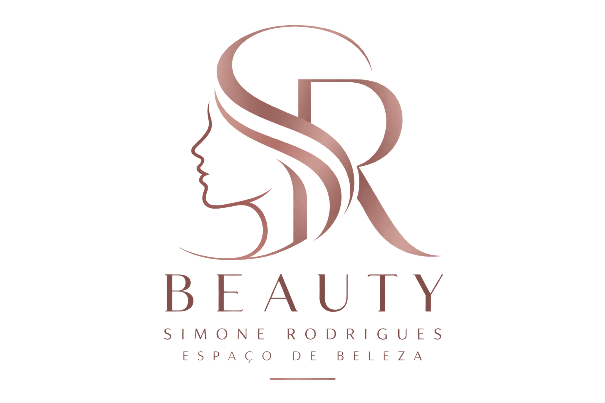

  

# SR Beauty

`Análise e Desenvolvimento de Sistemas - PUC Minas`

`Desenvolvimento de um Sistema Sociotécnico Inovador`

`2º semestre/2026`

O SR Beauty é um sistema de gestão desenvolvido para o Simone Rodrigues Espaço de Beleza, com o objetivo de centralizar e facilitar o gerenciamento das atividades do salão. A aplicação busca otimizar o controle de agendamentos, profissionais, serviços, pagamentos, repasses e informações financeiras, proporcionando uma gestão mais organizada e eficiente.

O sistema foi desenvolvido como parte de um projeto acadêmico, considerando as necessidades identificadas junto ao parceiro e buscando aplicar conceitos de análise, desenvolvimento e validação de sistemas sociotécnicos. A solução contempla diferentes perfis de acesso — Cliente, Profissional e Proprietária —, permitindo que cada usuário tenha acesso às funcionalidades correspondentes às suas atividades.

Além de auxiliar na organização da rotina do salão, o SR Beauty busca reduzir processos manuais, facilitar o acompanhamento financeiro e proporcionar maior confiabilidade nas informações utilizadas para a tomada de decisões.

## Integrantes

* Flávia Sergina Rodrigues
* Júlio César Villaça Cardoso
* Luiz Guilherme Martins Franchim
* Pâmella Almeida da Silva
* Virgílio Parreiras Campos Zenith

## Orientador

* José Wilson da Costa

# Documentação

<ol>

<li><a href="documentos/01-Documentação de Contexto.md"> Documentação de Contexto</a></li>

<li><a href="documentos/02-Especificação do Projeto.md"> Especificação do Projeto</a></li>

<li><a href="documentos/03-Metodologia.md"> Metodologia</a></li>

<li><a href="documentos/04-Projeto de Interface.md"> Projeto de Interface</a></li>

<li><a href="documentos/05-Template padrão do Site.md"> Template padrão do Site</a></li>

<li><a href="documentos/06-Programação de Funcionalidades.md"> Programação de Funcionalidades</a></li>

<li><a href="documentos/07-Referências Bibliográficas.md"> Referências Bibliográficas</a></li>

</ol>

# Hospedagem

A aplicação SR Beauty é desenvolvida utilizando HTML, CSS e JavaScript na interface e Python com Flask no backend.

Durante o desenvolvimento local, a aplicação utiliza SQLite para persistência dos dados. No ambiente de produção, o sistema está hospedado na plataforma Render e utiliza PostgreSQL como banco de dados.

A aplicação pode ser acessada em:

<a href="https://srbeauty-app.onrender.com">SR Beauty - Aplicação Web</a>

O ambiente de produção está integrado ao repositório do projeto, permitindo a implantação de novas versões da aplicação por meio do recurso de Auto-Deploy do Render.

# Código-Fonte

<li><a href="codigo-fonte/README.md"> Código Fonte</a></li>

# Apresentação

<li><a href="apresentacao/README.md"> Apresentação da solução</a></li>