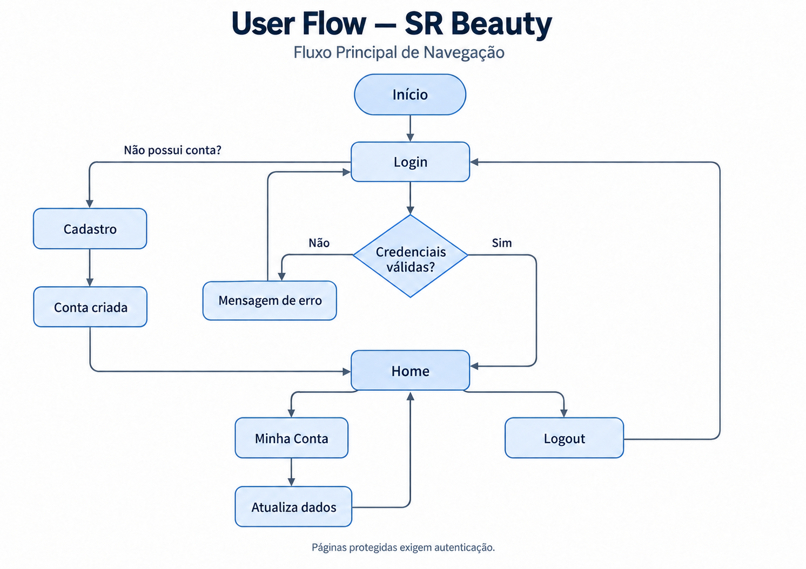
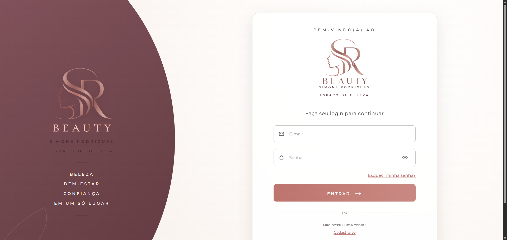
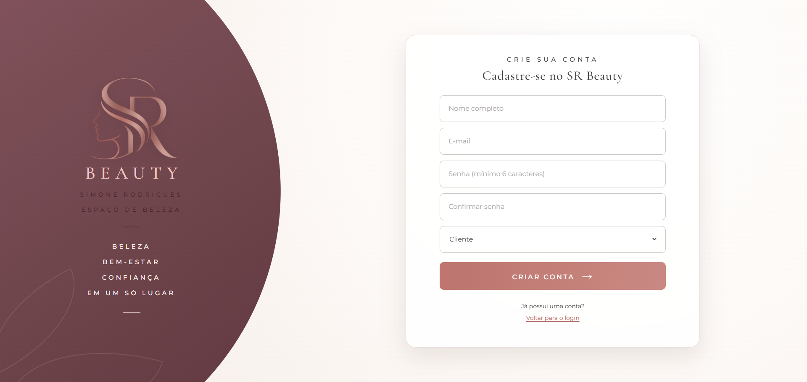
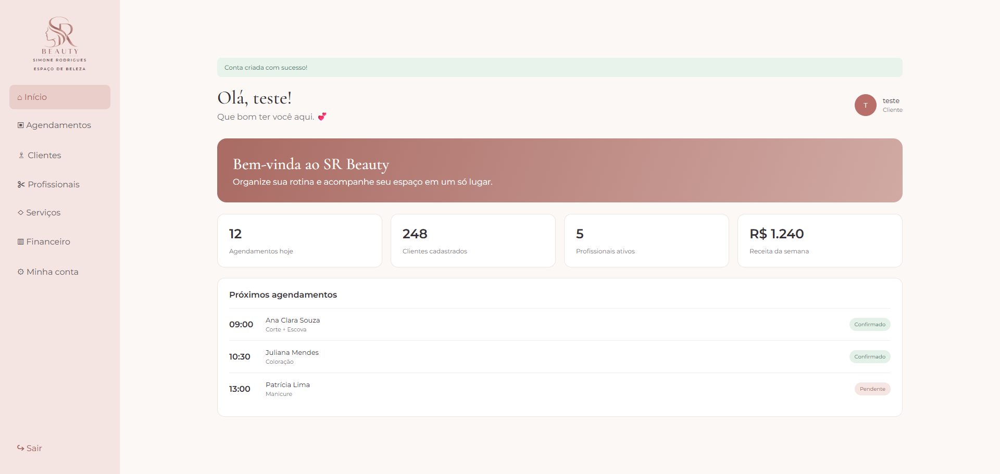

# Projeto de Interface

## User Flow

O User Flow do SR Beauty representa o fluxo principal de navegação atualmente implementado na aplicação, desde o acesso inicial até as funcionalidades disponíveis para o usuário autenticado.

Ao acessar o sistema, o usuário é direcionado para a tela de Login. Caso ainda não possua uma conta, poderá acessar a tela de Cadastro e criar um novo usuário. Após a autenticação bem-sucedida, o sistema direciona o usuário para a Home, que funciona como ponto principal de navegação da aplicação.

A partir da Home, o usuário pode acessar a área Minha Conta para consultar e atualizar seus dados pessoais. Também é possível encerrar a sessão por meio da funcionalidade de Logout, retornando à tela de Login.

Durante o processo de autenticação, credenciais inválidas impedem o acesso ao sistema e uma mensagem de erro é apresentada ao usuário. As páginas protegidas também exigem autenticação para serem acessadas.

O fluxo apresentado representa as funcionalidades implementadas até o momento e poderá ser ampliado conforme o desenvolvimento das demais áreas previstas para o SR Beauty, como agendamentos, profissionais, serviços e gestão financeira.

<figure>
    <figcaption>Figura 1 - Fluxo principal de navegação do SR Beauty.</figcaption>
</figure>

## Protótipo de baixa fidelidade

### Acesso ao protótipo navegável

O protótipo navegável do sistema pode ser acessado pelo link abaixo:

[Acessar os arquivos do protótipo](../codigo-fonte/Prototipo/)

O projeto de interface do SR Beauty foi planejado com foco em simplicidade, organização das informações e facilidade de navegação. A estrutura visual definida durante a prototipação serviu como referência para o desenvolvimento das telas atualmente disponíveis na aplicação.

As interfaces utilizam uma identidade visual comum, com cores, tipografia e componentes padronizados, buscando manter consistência durante a navegação.

De forma geral, as telas são organizadas a partir dos seguintes elementos:

<ul>

  <li><b>Identidade visual:</b> apresenta a marca SR Beauty e mantém o padrão visual da aplicação;</li>

  <li><b>Navegação:</b> disponibiliza acesso às funcionalidades permitidas ao usuário;</li>

  <li><b>Conteúdo principal:</b> apresenta informações, formulários e ações relacionadas à funcionalidade acessada;</li>

  <li><b>Mensagens de retorno:</b> apresentam confirmações, validações ou erros decorrentes das ações realizadas pelo usuário.</li>

</ul>

<h3><b>Tela – Login</b></h3>

A tela de Login é o ponto inicial de acesso ao SR Beauty. Ela permite que usuários cadastrados informem seu e-mail e senha para acessar a aplicação.

A interface também disponibiliza acesso ao cadastro de novos usuários e apresenta mensagens de validação quando as credenciais informadas são inválidas.

<figure>
    <figcaption>Figura 2 - Tela de Login do SR Beauty.</figcaption>
</figure>

**Requisitos contemplados:** RF-01, RF-13

<h3><b>Tela – Cadastro</b></h3>

A tela de Cadastro permite a criação de uma nova conta de usuário. Após o preenchimento e validação das informações, os dados são registrados no sistema e o usuário pode acessar a aplicação.

<figure>
    <figcaption>Figura 3 - Tela de Cadastro de usuário.</figcaption>
</figure>

**Requisitos contemplados:** RF-01

<h3><b>Tela – Home</b></h3>

A Home funciona como a área principal da aplicação após a autenticação. A interface apresenta a navegação lateral e informações resumidas relacionadas às principais áreas previstas para o SR Beauty, como agendamentos, clientes, profissionais, serviços e financeiro.

O conteúdo apresentado ao usuário poderá variar de acordo com seu perfil de acesso.

<figure>
    <figcaption>Figura 4 - Tela principal do SR Beauty.</figcaption>
</figure>

**Requisitos contemplados:** RF-13

<h3><b>Tela – Minha Conta</b></h3>

A tela Minha Conta permite que o usuário autenticado consulte e atualize as informações associadas ao seu cadastro.

As alterações realizadas são persistidas no sistema, permitindo que os dados atualizados sejam recuperados em acessos posteriores.

<figure>
    <figcaption>Figura 5 - Tela de gerenciamento da conta do usuário.</figcaption>
</figure>

**Requisitos contemplados:** RF-01
