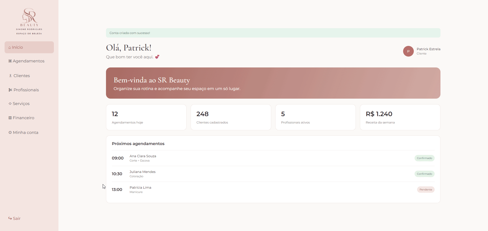
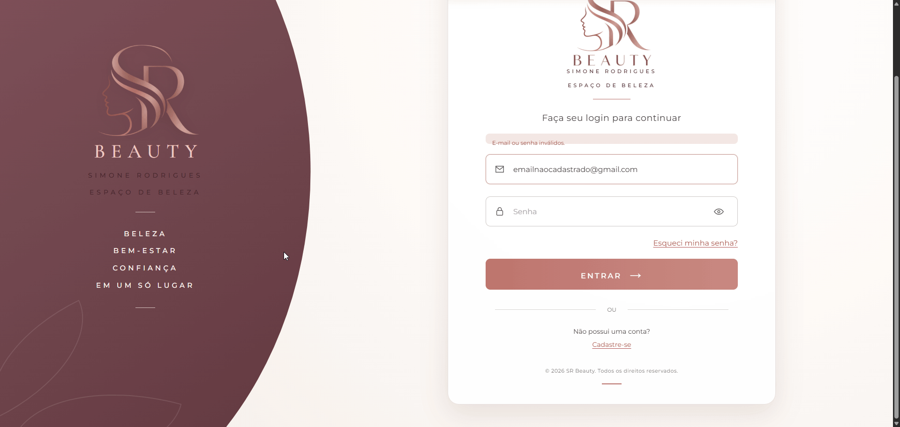
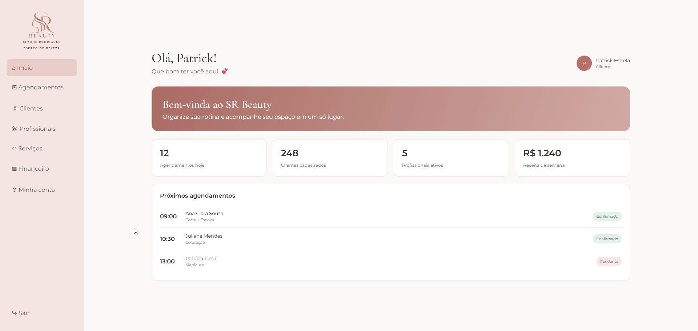

# Programação de Funcionalidades

Pré-requisitos:
<a href="02-Especificação do Projeto.md">Especificação do Projeto</a>,
<a href="03-Metodologia.md">Metodologia</a>,
<a href="04-Projeto de Interface.md">Projeto de Interface</a> e
<a href="05-Template padrão do Site.md">Template padrão da Aplicação</a>

As funcionalidades descritas nesta seção correspondem à versão desenvolvida do SR Beauty até o momento. Nesta etapa foram implementados o cadastro de usuários, autenticação, gerenciamento de sessão, acesso à área principal da aplicação, consulta e atualização dos dados da conta e logout.

A aplicação utiliza Python e Flask no backend, Flask-Login para gerenciamento das sessões dos usuários e Flask-SQLAlchemy para integração com o banco de dados. Durante o desenvolvimento local é utilizado SQLite, enquanto o ambiente de produção utiliza PostgreSQL.

### Cadastro de Usuário (RF-01)

Responsável: Luiz Guilherme Martins Franchim

A funcionalidade de Cadastro permite a criação de uma nova conta no SR Beauty. O usuário informa os dados necessários para seu registro e define uma senha para acesso à aplicação.

Antes da criação da conta, os dados informados são validados pela aplicação. O sistema também verifica se já existe um usuário cadastrado com o mesmo endereço de e-mail.

As senhas não são armazenadas em texto simples. Antes da persistência no banco de dados, são processadas utilizando mecanismo seguro de hash.

#### Requisito atendido

**RF-01:** A aplicação deve permitir ao usuário realizar cadastro, login e logout, além de consultar e atualizar os dados de sua conta.

#### Artefatos da funcionalidade

- `app.py`
- `templates/`
- `static/`
- Flask-SQLAlchemy
- Werkzeug
- banco de dados da aplicação

#### Instruções de acesso

1. Acesse a página inicial do SR Beauty;
2. Selecione a opção **Cadastre-se**;
3. Preencha os dados solicitados;
4. Confirme o cadastro;
5. Após a criação da conta, o usuário poderá acessar a área autenticada da aplicação.

### Login e Autenticação (RF-01)

Responsável: Luiz Guilherme Martins Franchim

A funcionalidade de Login permite que usuários cadastrados acessem o SR Beauty utilizando e-mail e senha.

As credenciais informadas são verificadas no servidor. Quando são válidas, uma sessão autenticada é criada e o usuário é direcionado para a Home.

Quando o e-mail informado não está cadastrado ou a senha está incorreta, o acesso é impedido e uma mensagem de erro é apresentada ao usuário.

#### Requisito atendido

**RF-01:** A aplicação deve permitir ao usuário realizar cadastro, login e logout, além de consultar e atualizar os dados de sua conta.

#### Artefatos da funcionalidade

- `app.py`
- `templates/`
- `static/`
- Flask-Login
- Werkzeug
- banco de dados da aplicação

#### Instruções de acesso

1. Acesse a página de Login;
2. Informe o e-mail e a senha cadastrados;
3. Se as credenciais forem válidas, o sistema direcionará o usuário para a Home;
4. Caso as credenciais sejam inválidas, o acesso será impedido e uma mensagem de erro será apresentada.

### Validação de Credenciais (RF-01)

Responsável: Luiz Guilherme Martins Franchim

Durante o processo de autenticação, a aplicação verifica os dados informados antes de permitir o acesso às áreas protegidas.

Credenciais inválidas não iniciam uma sessão de usuário e o sistema permanece na tela de Login, apresentando uma mensagem informativa para que uma nova tentativa seja realizada.

#### Requisito atendido

**RF-01:** A aplicação deve permitir ao usuário realizar cadastro, login e logout, além de consultar e atualizar os dados de sua conta.

#### Artefatos da funcionalidade

- `app.py`
- `templates/`
- Flask-Login
- Werkzeug

#### Instruções de acesso

1. Acesse a página de Login;
2. Informe um e-mail inexistente ou uma senha incorreta;
3. Selecione a opção de entrada;
4. O sistema impedirá o acesso e apresentará a mensagem de credenciais inválidas.

### Home e Controle de Sessão (RF-01)

Responsável: Luiz Guilherme Martins Franchim

Após a autenticação bem-sucedida, o usuário é direcionado para a Home do SR Beauty, que funciona como ponto principal de navegação da aplicação.

As páginas destinadas à área autenticada são protegidas por controle de sessão. Dessa forma, usuários não autenticados não podem acessar diretamente essas páginas e são redirecionados para a tela de Login.

A interface também identifica o usuário autenticado e apresenta seu perfil cadastrado no sistema.

#### Requisito atendido

**RF-01:** A aplicação deve permitir ao usuário realizar cadastro, login e logout, além de consultar e atualizar os dados de sua conta.

#### Artefatos da funcionalidade

- `app.py`
- `templates/`
- `static/`
- Flask-Login

#### Instruções de acesso

1. Realize o Login utilizando uma conta cadastrada;
2. Após a autenticação, o sistema direcionará o usuário para a Home;
3. O acesso direto às páginas protegidas sem autenticação redirecionará o usuário para a tela de Login.

### Minha Conta (RF-01)

Responsável: Luiz Guilherme Martins Franchim

A funcionalidade **Minha Conta** permite que o usuário autenticado consulte e atualize as informações associadas ao seu cadastro.

As alterações são validadas pela aplicação e persistidas no banco de dados. Dessa forma, os dados atualizados permanecem associados à conta e podem ser recuperados posteriormente.

#### Requisito atendido

**RF-01:** A aplicação deve permitir ao usuário realizar cadastro, login e logout, além de consultar e atualizar os dados de sua conta.

#### Artefatos da funcionalidade

- `app.py`
- `templates/`
- `static/`
- Flask-Login
- Flask-SQLAlchemy
- banco de dados da aplicação

#### Instruções de acesso

1. Realize o Login;
2. Na Home, acesse a opção **Minha Conta**;
3. Consulte ou altere os dados disponíveis;
4. Salve as alterações;
5. Os dados atualizados permanecerão registrados no banco de dados.

### Logout (RF-01)

Responsável: Luiz Guilherme Martins Franchim

A funcionalidade de Logout permite que o usuário encerre sua sessão no SR Beauty.

Após o encerramento da sessão, o usuário é direcionado novamente para a tela de Login e deixa de ter acesso às páginas protegidas até realizar uma nova autenticação.

#### Requisito atendido

**RF-01:** A aplicação deve permitir ao usuário realizar cadastro, login e logout, além de consultar e atualizar os dados de sua conta.

#### Artefatos da funcionalidade

- `app.py`
- Flask-Login

#### Instruções de acesso

1. Acesse o sistema utilizando uma conta autenticada;
2. Selecione a opção **Sair**;
3. A sessão será encerrada;
4. O sistema retornará para a tela de Login.

## Controle de Acesso por Perfil

O cadastro dos usuários já permite diferenciá-los entre os perfis **Cliente**, **Profissional** e **Proprietária**.

A implementação atual utiliza essa informação para identificar o perfil associado à conta. O controle de permissões específicas para cada perfil será desenvolvido nas próximas etapas da aplicação.

Dessa forma, o **RF-13 — controle de acesso às funcionalidades de acordo com o perfil do usuário — encontra-se parcialmente implementado**.

## Persistência e Segurança das Credenciais

Os usuários cadastrados são armazenados no banco de dados da aplicação. Durante o desenvolvimento local é utilizado SQLite e, no ambiente de produção, PostgreSQL.

As senhas são armazenadas somente após a aplicação de mecanismo seguro de hash, utilizando recursos disponibilizados pelo Werkzeug. A senha original não é mantida em texto simples no banco de dados.

Esse mecanismo contribui para o atendimento do requisito não funcional **RNF-02**, relacionado ao armazenamento seguro das credenciais dos usuários.