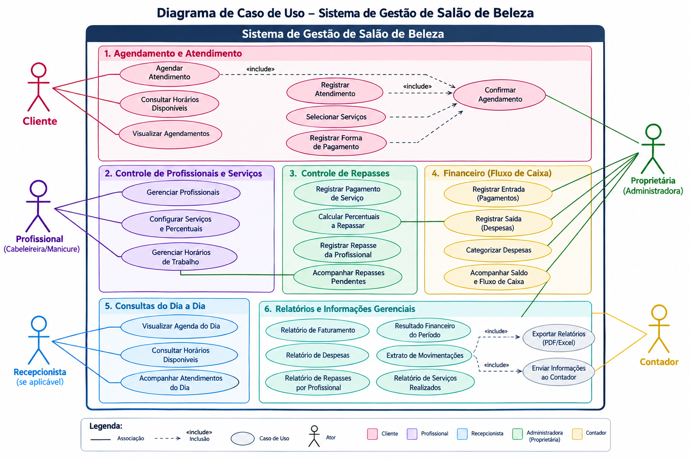

# Diagrama de Casos de Uso

## Sistema de Gestão de Salão de Beleza

Este documento apresenta o diagrama de casos de uso do sistema, com foco nas interações entre os atores e as principais funcionalidades do ambiente de gestão do salão. O objetivo é representar, de forma visual e acadêmica, os comportamentos esperados do sistema em relação ao agendamento de atendimentos, controle de profissionais, gestão financeira e geração de relatórios.

## 1. Diagrama de Casos de Uso

## 2. Atores do Sistema

- Cliente: realiza agendamentos, consulta horários disponíveis e acompanha atendimentos.
- Profissional: gerencia informações relacionadas aos serviços prestados, horários de trabalho e registros de atendimento.
- Recepcionista: acompanha a agenda do dia e auxilia no atendimento ao cliente.
- Proprietária / Administradora: coordena as operações financeiras, despesas, fluxo de caixa e relatórios gerenciais.
- Contador: analisa as informações financeiras e acessa relatórios consolidados do período.

## 3. Casos de Uso Principais

- Agendar atendimento;
- Consultar horários disponíveis;
- Registrar atendimento;
- Selecionar serviços;
- Confirmar agendamento;
- Gerenciar profissionais;
- Configurar serviços e percentuais;
- Gerenciar horários de trabalho;
- Registrar pagamentos e repasses;
- Acompanhar fluxo de caixa;
- Consultar agenda do dia;
- Gerar relatórios financeiros e operacionais.

## 4. Considerações

O diagrama foi estruturado com base nos requisitos funcionais e nos fluxos de operação do sistema, refletindo a dinâmica de uso esperada por clientes, profissionais e gestores. Sua finalidade é apoiar a análise do sistema, a validação dos requisitos e a organização da documentação de engenharia de software.
