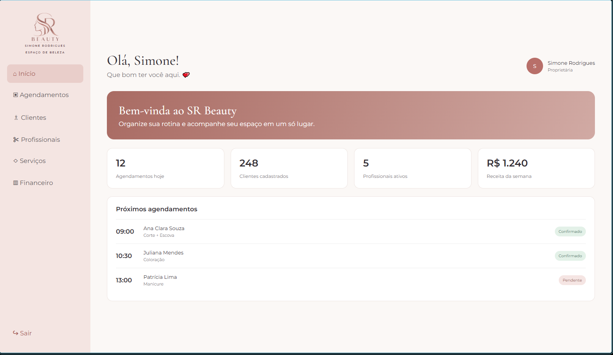

Este documento apresenta os casos de teste para as funcionalidades de Autenticação e Gestão de Usuários desenvolvidas nesta etapa, seguindo a estrutura acadêmica do projeto.

| Caso de Teste | Funcionalidade | Passos para Execução | Resultado Esperado | Evidência (Print) |
| :--- | :--- | :--- | :--- | :--- |
| **CT-01** | Cadastro com Sucesso | 1. Acessar `/cadastro`. 2. Preencher dados válidos. 3. Enviar formulário. | Criação do usuário e redirecionamento automático para a Home. |  |
| **CT-02** | Login com Erro | 1. Acessar `/login`. 2. Inserir dados inválidos (ex: e-mail incompleto). 3. Enviar. | Exibição de mensagem de erro de validação. |  |
| **CT-03** | Login com Sucesso | 1. Acessar `/login`. 2. Inserir credenciais válidas. 3. Enviar. | Autenticação efetuada e redirecionamento para o painel principal. |  |
| **CT-04** | Logout do Sistema | 1. Na tela logada, clicar em "Sair" na barra lateral. | Sessão encerrada e usuário redirecionado para a tela de login. |  |
